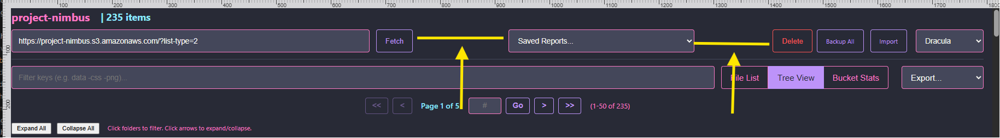
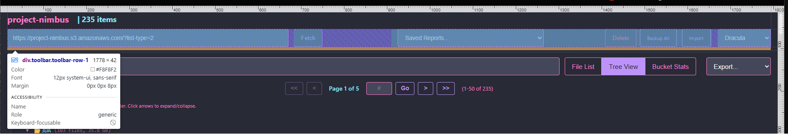
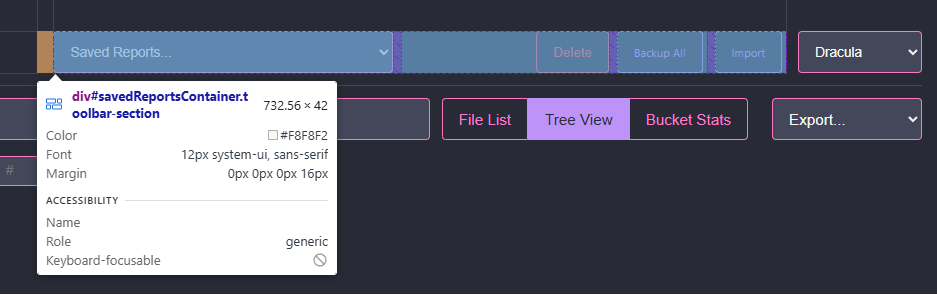
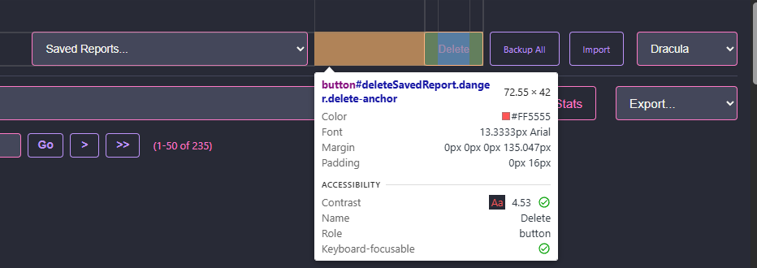

This screenshot shows the tool bar in question. The yellow marks are the highlights I added to emphasize the gaps between the report selector dropdown, and the delete report button. As you can see the drop down selector does not extend the full width of the viewport, with visible gaps between the dropdown 

- `div.toolbar.toolbar-row-1`

 - This is the containing cell that spans the width of the Viewport.

- `savedReportsContainer` also does not extend to the "fetch" button, which creates the second gap.

 - `deleteSavedReport.danger.delete-anchor` appears to have additional whitespace , which creates the unwanted gap between the delete button and the dropdown selector.

## TASK

Refactor the styles and html of the plugin so that the gaps are eliminated, and `savedReportsContainer` spans the width of the viewport.

Styles for toolbars in [styles.css](/burning-chrome/styles.css) begin around line `1400` and around line `1500`.