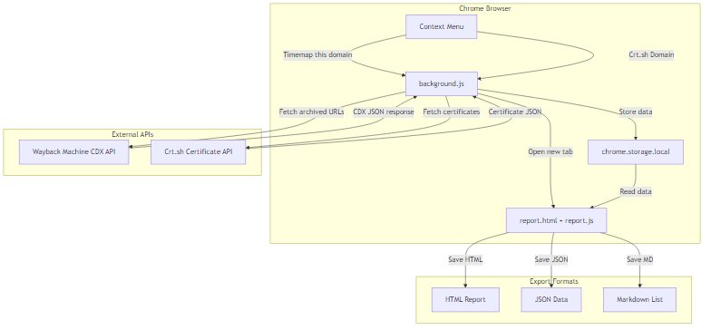

# Burning Chrome

A Chrome extension for generating Wayback Machine Timemap and Crt.sh SSL certificate reports.

## Features

- **Wayback Machine Timemap**: Fetch all archived URLs for any domain from the Internet Archive CDX API
- **Crt.sh Subdomain Discovery**: Query SSL certificate transparency logs to find subdomains
- Interactive HTML reports with live filtering, sorting, and search
- Multiple export formats: HTML, JSON, Markdown, CSV
- Dracula-themed dark UI
- Batch selection and deletion of records
- Direct links to archived snapshots and live pages

## Architecture



### Component Overview

| Component | File | Purpose |
|-----------|------|---------|
| Service Worker | `background.js` | Handles context menu events, fetches data from APIs, manages storage |
| Report UI | `report.js` | Renders tables, handles filtering/selection, manages exports |
| Export Library | `lib/export.js` | Download helpers for HTML, JSON, and raw file exports |
| Styles | `styles.css` | Dracula-themed dark mode styling |
| Entry Point | `report.html` | HTML shell that loads the bundled report script |

### Data Flow

1. **User Interaction**: Right-click on any webpage and select "Timemap this domain" or "Crt.sh Domain"
2. **Background Processing**: Service worker extracts the domain and begins fetching data
3. **Storage**: Data is written to `chrome.storage.local` with loading/progress state
4. **Report Display**: A new tab opens `report.html` which polls storage for updates
5. **Rendering**: Once data arrives, the report table renders with filtering controls
6. **Export**: User can export filtered data in multiple formats

## Installation

1. Clone or download this repository
2. Navigate to the `burning-chrome` folder:
   ```bash
   cd burning-chrome
   ```
3. Install dependencies:
   ```bash
   npm install
   ```
4. Build the bundle:
   ```bash
   npm run build
   ```
5. Open Chrome and navigate to `chrome://extensions`
6. Enable **Developer mode** (toggle in top right)
7. Click **Load unpacked**
8. Select the `burning-chrome` folder

## Development

### Building

After modifying `report.js` or any of its dependencies, rebuild the bundle:

```bash
npm run build
```

This uses [Rollup](https://rollupjs.org/) to bundle `report.js` with its dependencies (like the `mime` package) into `dist/report.js`.

### Build Configuration

The Rollup config (`rollup.config.js`) uses:
- `@rollup/plugin-node-resolve` - Resolves npm packages
- `@rollup/plugin-commonjs` - Converts CommonJS modules to ES modules

### Project Structure

```
burning-chrome/
  background.js       # Service worker (context menus, API calls)
  report.js           # Source UI logic (filtered, exported)
  report.html         # Report page shell
  styles.css          # Dracula theme styles
  manifest.json       # Chrome extension manifest v3
  rollup.config.js    # Rollup bundler configuration
  package.json        # npm dependencies and scripts
  lib/
    export.js         # Download/export utilities
  dist/
    report.js         # Bundled output (generated)
  icons/              # Extension icons
  fixtures/           # Test data fixtures
```

## Usage

### Wayback Machine Timemap

1. Navigate to any website
2. Right-click anywhere on the page
3. Select **"Timemap this domain"**
4. A new tab opens with all archived URLs for that domain
5. Use filters to narrow results by status code, MIME type, or search text
6. Click **ARC** to view the archived snapshot, **LIV** for the live page

### Crt.sh Subdomain Discovery

1. Navigate to any website
2. Right-click anywhere on the page
3. Select **"Crt.sh Domain"**
4. View all SSL certificates issued for the domain and its subdomains
5. Discover subdomains from the certificate's Common Name and SAN fields

## Export Formats

| Format | Extension | Description |
|--------|-----------|-------------|
| HTML | `.html` | Full styled report (same as displayed) |
| JSON | `.json` | Structured data array |
| Markdown | `.md` | Clickable link list with timestamps |
| CSV | `.csv` | Comma-separated values (Crt.sh only) |

## API Sources

- **Wayback Machine CDX API**: `https://web.archive.org/cdx/search/cdx`
  - Uses `showResumeKey=true` for paginated fetching of large result sets
  - Automatic retry with exponential backoff on rate limits (429/503)
  
- **Crt.sh API**: `https://crt.sh/json?q={domain}`
  - Returns certificate transparency log entries

## License

See [LICENSE](../LICENSE) for details.
