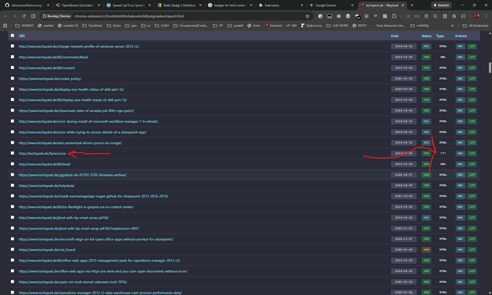

# Burning Chrome

A Chrome extension that generates Wayback Machine Timemap reports for any domain.

## Features

- Right-click context menu: "Timemap this domain"
- Fetches archived URL data from the Wayback Machine CDX API
- Displays an interactive HTML report with:
  - Live filtering/search
  - Export to HTML, JSON, or Markdown

## Installation

1. Clone or download this repository
2. Run `npm install` in the `burning-chrome` folder
3. Run `npm run build` to bundle dependencies
4. Open Chrome and navigate to `chrome://extensions`
5. Enable "Developer mode" (toggle in top right)
6. Click "Load unpacked"
7. Select this `burning-chrome` folder

## Development

After making changes to `report.js`:
```bash
npm run build
```

This bundles the source with dependencies using Rollup.

## Usage

1. Navigate to any website
2. Right-click anywhere on the page
3. Select "Timemap this domain"
4. A new tab opens with all archived URLs for that domain

## Export Formats

- **HTML**: Full styled report (same as displayed)
- **JSON**: Raw API response data
- **Markdown**: Clickable link list format

