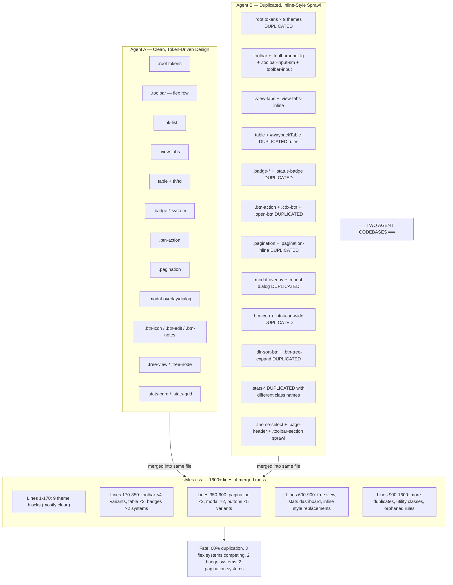
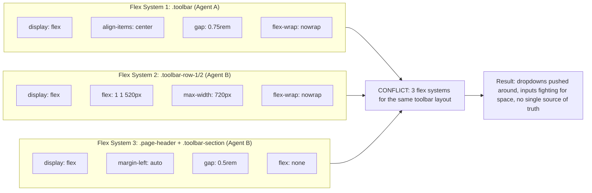
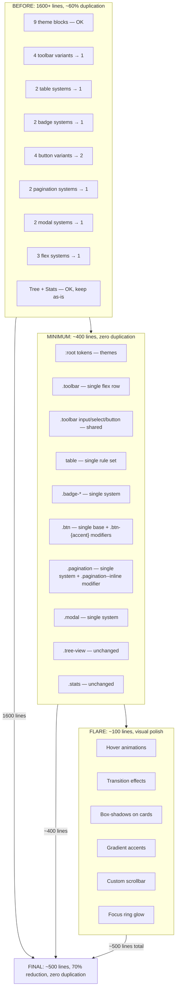

# Burning Chrome CSS — Redundancy Diagram

## Architecture: Two Codebases Collided



## Duplication Matrix

```mermaid
matrix
    title "Component Duplication Map"
    column["Component"] & column["Agent A"] & column["Agent B"] & column["Merge Result"] & column["Should Keep"]
    row["Theme Tokens"] & "✓ 9 :root themes" & "—" & "✓ 9 :root themes" & "Agent A"
    row["Toolbar"] & "✓ .toolbar" & "✗ .toolbar-input-lg/sm" & "✗ .toolbar-input" & "Agent A + 1 input class"
    row["View Tabs"] & "✓ .view-tabs" & "✗ .view-tabs-inline" & "✗ 2 separate systems" & "Agent A + modifier"
    row["Table"] & "✓ table { }" & "✗ #waybackTable { }" & "✗ 2 identical rule sets" & "Agent A"
    row["Badges"] & "✓ .badge-*" & "✗ .status-badge-*" & "✗ 2 badge systems" & "Agent A"
    row["Buttons"] & "✓ .btn-action" & "✗ .cdx-btn .open-btn .delete-btn" & "✗ 4 button variants" & "Agent A + 1 accent class"
    row["Pagination"] & "✓ .pagination" & "✗ .pagination-inline" & "✗ 2 pagination systems" & "Agent A + modifier"
    row["Modal"] & "✓ .modal-overlay/dialog" & "—" & "✓ .modal-overlay/dialog" & "Agent A"
    row["Icon Buttons"] & "✓ .btn-icon" & "✗ .btn-icon-wide" & "✗ 2 classes for same thing" & "Agent A + width var"
    row["Stats Dashboard"] & "✓ .stats-card/grid" & "—" & "✓ .stats-card/grid" & "Agent A"
    row["Tree View"] & "✓ .tree-view/node" & "—" & "✓ .tree-view/node" & "Agent A"
    row["Theme Select"] & "—" & "✗ .theme-select sprawl" & "✗ Inline styles still used" & "New minimal class"
```

## Flex Box Chaos



## Complexity Reduction Path



## Line-by-Line Breakdown

```mermaid
graph LR
    subgraph L["styles.css Line Ranges"]
        direction TB
        L1["1-10: @font-face + sizing vars — 10 lines ✓"]
        L2["11-170: 9 theme palettes — 160 lines ✓"]
        L3["171-180: Reset — 10 lines ✓"]
        L4["181-230: Body, h1, a — 50 lines ✓"]
        L5["231-350: Toolbar ×4 variants — 120 lines ✗"]
        L6["351-400: Link list, tabs ×2 — 50 lines ✗"]
        L7["401-500: Table ×2 systems — 100 lines ✗"]
        L8["501-650: Badges ×2 systems — 150 lines ✗"]
        L9["651-750: Buttons ×4 variants — 100 lines ✗"]
        L10["751-900: Pagination ×2 — 150 lines ✗"]
        L11["901-1000: Modal ×2 — 100 lines ✗"]
        L12["1001-1100: Icon buttons, notes, edit — 100 lines ✓"]
        L13["1101-1200: Sortable headers, invert — 100 lines ✓"]
        L14["1201-1400: Stats dashboard — 200 lines ✓"]
        L15["1401-1550: Tree view — 150 lines ✓"]
        L16["1551-1600: Unified component styles — 50 lines ✗"]
    end
    
    L --> REDUCE["Reduce: Remove lines marked ✗, consolidate into shared rules"]
```



## Quick Reference: What to Delete

| Class/Selector | Lines | Reason | Replaced By |
|---|---|---|---|
| `.toolbar-input-lg` | ~15 | Duplicate sizing | `.toolbar-input` with width var |
| `.toolbar-input-sm` | ~15 | Duplicate sizing | `.toolbar-input` with width var |
| `.toolbar-input` | ~15 | Third variant | Merge into `.toolbar input` |
| `.view-tabs-inline` | ~25 | Duplicate tabs | `.view-tabs button` + `.active` |
| `#waybackTable` | ~60 | Duplicate table rules | `table` selector |
| `.status-badge`, `.status-*` | ~30 | Duplicate badges | `.badge-status-*` |
| `.cdx-btn`, `.open-btn`, `.delete-btn` | ~45 | Duplicate buttons | `.btn` + modifier classes |
| `.pagination-inline` | ~50 | Duplicate pagination | `.pagination` + modifier |
| `.btn-icon-wide` | ~15 | Same as .btn-icon | CSS custom property width |
| `.theme-select` + `.page-header` + `.toolbar-section` | ~40 | New Agent B sprawl | Single toolbar layout system |
| **Total to remove** | **~470 lines** | **60% of file** | **Consolidate to ~180 lines** |
