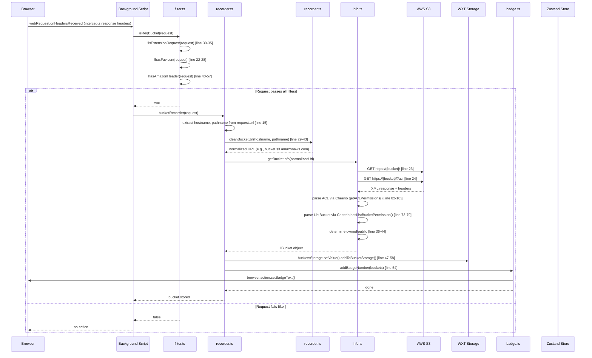
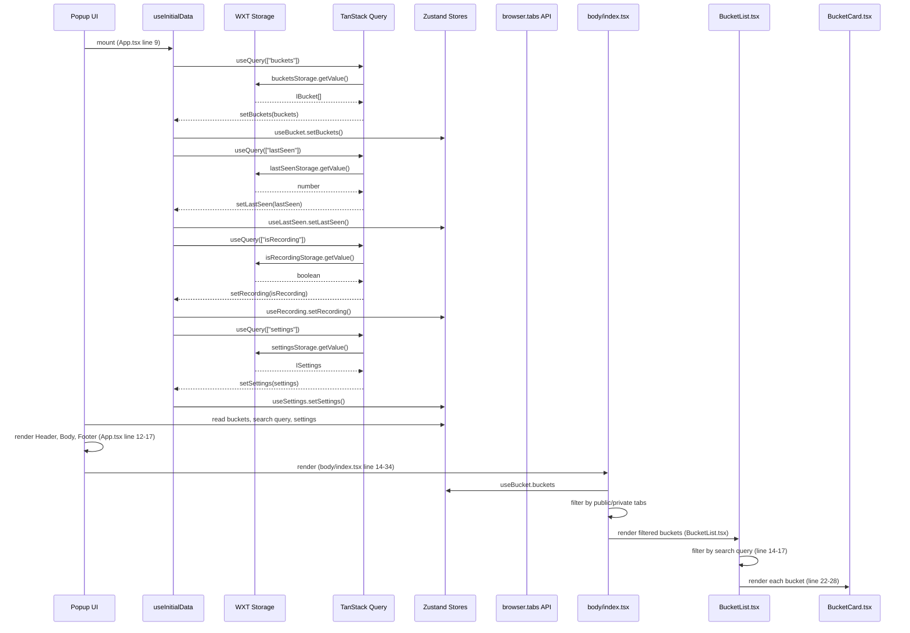
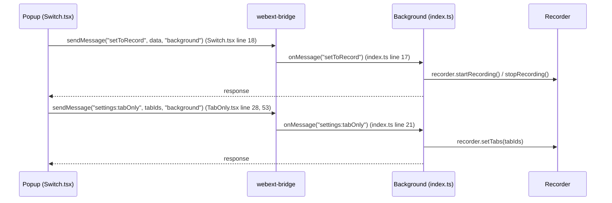

# S3BucketList — Architecture & Portability Analysis

This is an analysis of the code at [https://github.com/thesavant42/S3BucketList](https://github.com/thesavant42/S3BucketList) which is a fork a browser extension that creates a badge notification icon when an open bucket is observed.

 This analysis was performed with the goal of identifying the components and patterns that would be useful to extend the burning chrome extension.

## 1. Project Overview

**S3BucketList** is a WXT (WebExtensions TypeScript) browser extension that detects Amazon S3 buckets by intercepting network requests and probing their ACL/ListBucket permissions. It supports Chrome and Firefox.

**Version**: 4.1.2  
**Tech Stack**: WXT 0.20.0, React 19, TypeScript 5.8, Zustand 5, TanStack Query 5, Tailwind CSS 4, shadcn/ui

---

## 2. Core Functionality

The extension has two distinct layers:

### 2.1. S3 Detection Engine (portable logic)

Pure TypeScript functions that detect S3 buckets, parse ACLs, and extract bucket metadata. This is the reusable core.

### 2.2. Browser Extension Shell (non-portable)

WXT-specific plumbing: background service worker, popup UI, browser APIs, storage, messaging.

---

## 3. Sequence Diagrams

### 3.1. Full Detection Flow



### 3.2. Popup UI Data Flow



### 3.3. Background-Popup Communication



---

## 4. File-by-File Breakdown

### 4.1. S3 Detection Engine (portable)

| File | Purpose | Lines | Key Exports | Portable? |
|------|---------|-------|-------------|-----------|
| `src/lib/bucket/recorder.ts` | Main detection entry point, URL cleaning, storage | 1-58 | `bucketRecorder()`, `cleanBucketUrl()`, `addToBucketStorage()` | **Partial** — `cleanBucketUrl()` is portable; `addToBucketStorage()` depends on WXT storage |
| `src/lib/bucket/filter.ts` | Request filtering (extension, favicon, Amazon headers) | 1-57 | `isReqBucket()`, `hasFavicon()`, `isExtensionRequest()`, `hasAmazonHeader()` | **Yes** — pure functions, no external deps |
| `src/lib/bucket/info.ts` | Bucket ACL/ListBucket probing via HTTP + Cheerio parsing | 1-110 | `getBucketInfo()`, `hasListBucketPermission()`, `getACLPermissions()`, `isPublic()` | **Yes** — only depends on axios + cheerio |
| `src/lib/bucket/badge.ts` | Browser action badge management | 1-32 | `addBadgeNumber()`, `stopRecordingBadge()` | **No** — uses `browser.action` API |
| `src/lib/bucket/index.ts` | Barrel export | 1-3 | re-exports recorder, filter, info | N/A |
| `src/lib/logger.ts` | Simple console logger | 1-4 | `logger()` | **Yes** — trivial utility |

### 4.2. Extension Plumbing (non-portable)

| File | Purpose | Lines | Dependencies |
|------|---------|-------|-------------|
| `src/entrypoints/background/index.ts` | Service worker entry, message handlers | 1-23 | `webext-bridge`, `Recorder` |
| `src/lib/bucket/Recorder.class.ts` | Wraps `browser.webRequest.onHeadersReceived` | 1-42 | `browser.webRequest` API |
| `src/lib/storage.ts` | WXT `storage.defineItem` declarations | 1-32 | `storage` (WXT global) |
| `src/entrypoints/popup/main.tsx` | React entry point, QueryClient setup | 1-17 | React, ReactDOM, TanStack Query |
| `src/entrypoints/popup/App.tsx` | Root component | 1-19 | React, section components |
| `src/lib/hooks/useInitialData.ts` | Initial data fetch via TanStack Query | 1-62 | TanStack Query, stores, storage, `browser.action` |

### 4.3. State Management (portable concept, extension-specific impl)

| File | Purpose | Lines | Portable? |
|------|---------|-------|-----------|
| `src/lib/store/useBucket.store.ts` | Bucket list state | 1-15 | **Concept yes, impl no** — Zustand is portable, but this file is tightly coupled to the extension's data flow |
| `src/lib/store/useSettings.store.ts` | Tab-only settings | 1-18 | Same as above |
| `src/lib/store/useRecording.store.ts` | Recording toggle state | 1-15 | Same as above |
| `src/lib/store/useSearch.store.ts` | Search query state | 1-12 | Same as above |
| `src/lib/store/useLastSeen.store.ts` | Last-seen timestamp | 1-12 | Same as above |

### 4.4. UI Components (extension-specific, not portable)

| Directory | Purpose |
|-----------|---------|
| `src/components/sections/header/` | Header with logo + recording switch |
| `src/components/sections/body/` | Body with tabs (public/private), search, bucket list |
| `src/components/sections/footer/` | Footer with settings sheet, help, rate links |
| `src/components/ui/` | shadcn/ui primitives (Badge, Button, Card, etc.) |

### 4.5. Type Definitions

| File | Purpose | Portable? |
|------|---------|-----------|
| `src/@types/index.ts` | `IBucket`, `IPermissions`, `IAclPermissions`, `ISettings` | **Yes** — pure TypeScript interfaces |

---

## 5. Dependency Analysis

### 5.1. Runtime Dependencies

| Package | Version | Used By | Reusable? |
|---------|---------|---------|-----------|
| `axios` | ^1.9.0 | `info.ts` — HTTP probing of S3 buckets | **Yes** — standard HTTP client |
| `cheerio` | ^1.0.0 | `info.ts` — XML parsing of ACL/ListBucket responses | **Yes** — standard parser |
| `webext-bridge` | ^6.0.1 | Background-popup messaging | **No** — extension-specific |
| `zustand` | ^5.0.5 | State management | **Yes** — portable state library |
| `@tanstack/react-query` | ^5.77.2 | Data fetching in popup | **Yes** — portable data library |
| `@tailwindcss/vite` | ^4.1.4 | CSS build | **No** — extension UI only |
| `wxt` | ^0.20.0 (dev) | Extension framework | **No** — extension shell |
| `react` | ^19.1.0 | Popup UI | **Yes** — portable, but UI is extension-specific |

### 5.2. External APIs

| API | Used By | Portable? |
|-----|---------|-----------|
| `browser.webRequest.onHeadersReceived` | `Recorder.class.ts` | **No** — only available in browser extensions |
| `browser.storage.local` (via WXT) | `storage.ts` | **Partial** — Web Storage API is available in browsers, but WXT wrapper is extension-specific |
| `browser.action.setBadgeText` | `badge.ts`, `useInitialData.ts`, `Switch.tsx` | **No** — extension-specific |
| `browser.tabs.query` | `TabOnly.tsx` | **Partial** — available in extensions |
| `window.open` | `OptionsDropdown.tsx` | **Yes** — standard browser API |

---

## 6. Portability Assessment

### 6.1. What CAN be harvested as a shared library

The **S3 Detection Engine** (`src/lib/bucket/`) is largely portable:

```html
src/lib/bucket/
├── filter.ts       ← 100% portable (pure functions)
├── info.ts         ← 100% portable (axios + cheerio only)
├── recorder.ts     ← 70% portable (cleanBucketUrl is portable; addToBucketStorage needs abstraction)
├── badge.ts        ← 0% portable (browser.action API)
├── index.ts        ← barrel export
└── Recorder.class.ts ← 0% portable (browser.webRequest API)
```

**Recommended library structure:**

```html
s3-bucket-detector/          ← new shared package
├── src/
│   ├── filter.ts            ← isReqBucket(), hasAmazonHeader(), etc.
│   ├── info.ts              ← getBucketInfo(), getACLPermissions(), hasListBucketPermission()
│   ├── url.ts               ← cleanBucketUrl() (rename from recorder.ts)
│   ├── types.ts             ← IBucket, IPermissions, IAclPermissions
│   └── index.ts             ← barrel exports
├── package.json
└── tsconfig.json
```

**What needs abstraction for portability:**

- `addToBucketStorage()` in `recorder.ts` — depends on WXT storage. Replace with a callback or interface: `onBucketFound(bucket: IBucket): void`
- `badge.ts` — extension-specific. Not worth porting; each consumer manages its own badge/notification

### 6.2. What CANNOT be harvested (extension-specific)

| Component | Reason |
|-----------|--------|
| `Recorder.class.ts` | Uses `browser.webRequest` API — only available in browser extensions |
| `storage.ts` | Uses WXT `storage.defineItem` — WXT-specific |
| `badge.ts` | Uses `browser.action` API — extension-specific |
| `entrypoints/background/` | WXT service worker — extension shell |
| `entrypoints/popup/` | React popup UI — extension-specific |
| `components/sections/` | Extension popup layout — not reusable |
| `components/ui/` | shadcn/ui components — extension UI only |

### 6.3. What CAN be reused conceptually

| Component | How to reuse |
|-----------|-------------|
| Zustand stores | Use Zustand directly in any React app |
| TanStack Query | Use `@tanstack/react-query` for data fetching in any React app |
| `useInitialData()` pattern | Adapt the pattern: fetch from storage → set in store → manage loading state |
| `cn()` utility | Copy `lib/utils.ts` — it's just `clsx` + `tailwind-merge` |

---

## 7. Recommended Porting Strategy

### Option A: Extract as Shared Package (Recommended)

Create `packages/s3-bucket-detector/` (monorepo) or publish as npm package:

```
S3BucketList/
├── packages/
│   └── s3-bucket-detector/   ← portable library
│       ├── src/
│       │   ├── filter.ts
│       │   ├── info.ts
│       │   ├── url.ts
│       │   ├── types.ts
│       │   └── index.ts
│       ├── package.json
│       └── tsconfig.json
├── src/                        ← existing extension (consumes library)
└── package.json
```

**Migration steps:**

1. Copy `filter.ts`, `info.ts`, `cleanBucketUrl()` from `recorder.ts`, and `@types/index.ts` to the new package
2. Abstract `addToBucketStorage()` — replace with a callback interface `BucketHandler`
3. Update extension imports to use the new package
4. Publish to npm (or keep as local monorepo package)

**Dependencies for the library:** `axios`, `cheerio` (peer deps optional)

### Option B: Rewrite from Scratch in Target Extension

If the target extension doesn't use React/TanStack Query/Zustand, the UI and state layers would need a full rewrite. Only the detection engine (`filter.ts` + `info.ts` + `url.ts`) would be worth copying.

---

## 8. Known Issues & Blind Spots

### 8.1. URL Normalization Blind Spot (Critical)

`cleanBucketUrl()` normalizes path-style URLs (`s3.amazonaws.com/bucket/`) to virtual-hosted style (`bucket.s3.amazonaws.com`) **before** probing with `getBucketInfo()`.

**The blind spot**: the probe hits the **normalized** URL, not the **original** URL that triggered detection.

| Original Request | URL Probed | Risk |
|-----------------|------------|------|
| `s3.amazonaws.com/my-bucket/` | `my-bucket.s3.amazonaws.com` | Probes virtual-hosted, not path-style |
| `s3.us-east-1.amazonaws.com/my-bucket/` | `my-bucket.s3.amazonaws.com` | Probes virtual-hosted, not regional path-style |
| `my-bucket.s3.amazonaws.com/` | `my-bucket.s3.amazonaws.com` | ✅ Correct — already virtual-hosted |

If a bucket has different ACL/ListBucket permissions on path-style vs virtual-hosted style, the plugin probes the **wrong** access path and may report incorrect permissions. It could miss a publicly accessible bucket (path-style open, virtual-hosted locked) or flag a private bucket as public (virtual-hosted open, path-style locked).

**Fix**: probe the original intercepted URL first, then probe the alternative form. This ensures both access paths are checked regardless of which style triggered detection.

### 8.2. No HTTPS Certificate Validation

`info.ts` line 9 creates an axios instance with `rejectUnauthorized: false`. This disables TLS certificate verification, which is necessary for probing buckets that may have self-signed or misconfigured certificates but introduces MITM risk.

### 8.3. Duplicate Detection

`addToBucketStorage()` deduplicates by `hostname` (line 51-52). Since `cleanBucketUrl()` normalizes all URLs to virtual-hosted style, path-style and virtual-hosted style requests for the same bucket are correctly deduplicated.

---

## 9. Summary Table

| Component | Portable? | Effort to Port | External Deps |
|-----------|-----------|----------------|---------------|
| `filter.ts` | ✅ Yes | Low | None |
| `info.ts` | ✅ Yes | Low | axios, cheerio |
| `cleanBucketUrl()` | ✅ Yes | Low | None |
| `IBucket`/`IPermissions` types | ✅ Yes | None | None |
| `addToBucketStorage()` | ⚠️ Partial | Medium | WXT storage → abstract as callback |
| `Recorder.class.ts` | ❌ No | N/A | browser.webRequest API |
| `badge.ts` | ❌ No | N/A | browser.action API |
| `storage.ts` | ❌ No | N/A | WXT storage |
| Popup UI | ❌ No | N/A | React, shadcn/ui, Tailwind |
| Zustand stores | ⚠️ Concept yes | Low | Zustand (portable) |
| TanStack Query | ⚠️ Concept yes | Low | @tanstack/react-query (portable) |